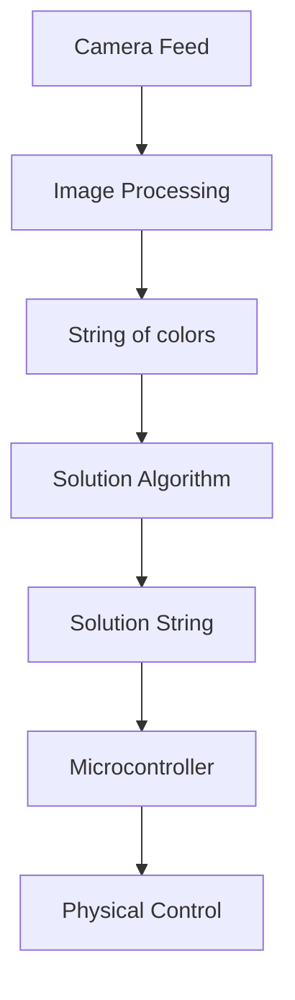
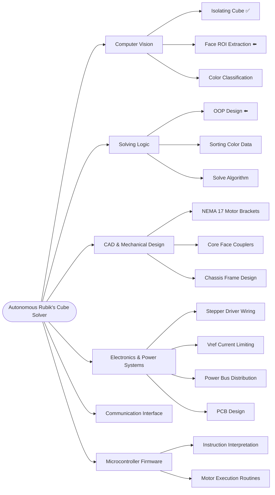
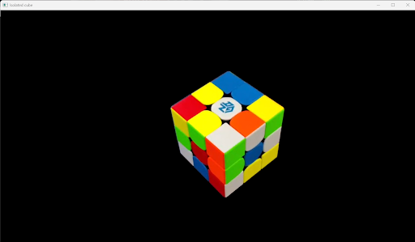
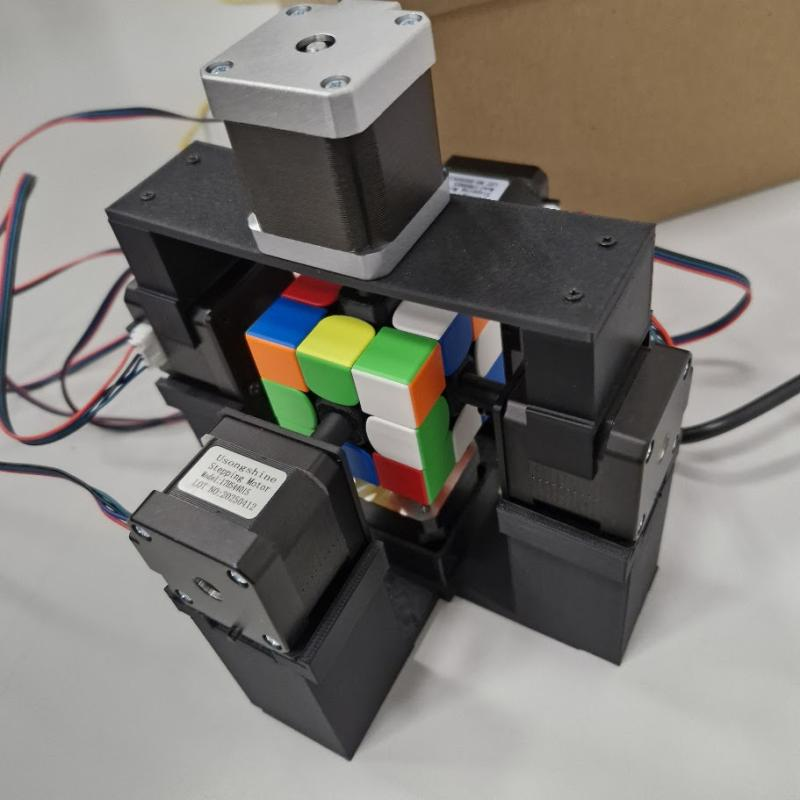

# Rubik's Cube Solver

> A Rubik's Cube solver combining a Python computer vision scanner for state-capture with an Arduino stepper controller to physically resolve the puzzle.

## Main Pipeline

## Work Breakdown Structure (WBS)

## Tech Stack & Hardware Components

| Domain | Technologies / Components |
| -------- | -------- |
| Software & Computer Vision | Python 3.13.3, OpenCV, NumPy |
| Microcontroller  | Arduino Mega |
| Electronics | DRV8825 Drivers, 12V DC Power Supply |
| Actuators | NEMA 17 Stepper Motors |
| CAD & Mechanical | Custom 3D Printed Motor Brackets, Core Couplers, Frame Chassis |

## Gallery

<figure>
    
    <figcaption><i>Isolation of the cube by computer vision >> next step: extract ROIs (valid faces)</i></figcaption>
</figure>

<figure>
    
    <figcaption><i>This is an old prototype of the project; a new design will be shared soon.</i></figcaption>
</figure>