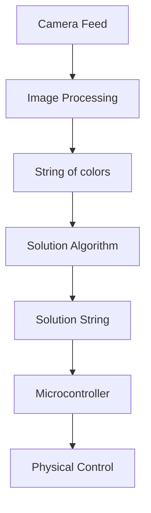
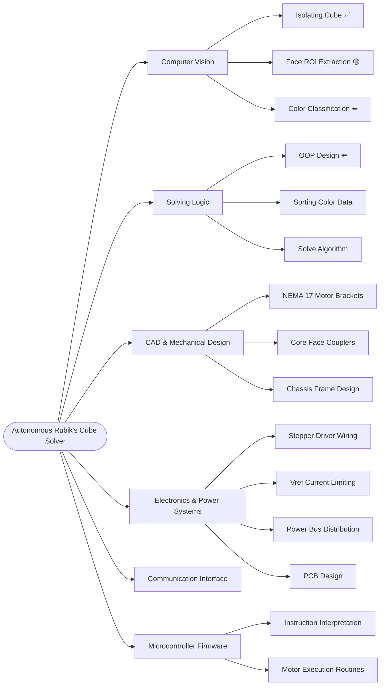

# Rubik's Cube Solver

> A Rubik's Cube solver combining a Python computer vision scanner for state-capture with an Arduino stepper controller to physically resolve the puzzle.

## Main Pipeline

## Work Breakdown Structure (WBS)

* ✅ **Completed** - The feature is fully functional and implemented.
* ⬅️ **WIP** - Currently being developed or under active work.
* 🟡 **In Testing** – The code/design is done and currently undergoing validation.
* (None) **Not Started** - Planned feature; development has not yet begun.

## Tech Stack & Hardware Components

| Domain | Technologies / Components |
| -------- | -------- |
| **Software & Computer Vision** | Python 3.13.3, OpenCV, NumPy |
| **Microcontroller**  | Arduino Mega |
| **Electronics** | DRV8825 Drivers, 12V DC Power Supply |
| **Actuators** | NEMA 17 Stepper Motors |
| **CAD & Mechanical** | Custom 3D Printed Motor Brackets, Core Couplers, Frame Chassis |

## Gallery

<figure>
    
    <figcaption><i>Isolation of the cube by computer vision >> next step: extract ROIs (valid faces)</i></figcaption>
</figure>
  

<figure>
    
    <figcaption><i>Face detection and Region of Interest (ROI) generation for each detected face</i></figcaption>
</figure>

<figure>
    
    <figcaption><i>This is an old prototype of the project; a new design will be shared soon.</i></figcaption>
</figure>