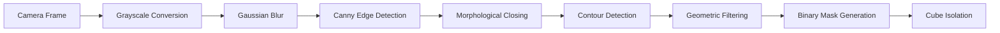

# System Architecture & Technical Specifications

> **Project:** Autonomous Rubik's Cube Solver
>
> **Status:** Work in progress

---

## System Overview

The primary objective of this project is to scan, solve, and physically manipulate a 3x3 Rubik's Cube.

The architecture is split into two main subsystems:
1. **Software:** Handles camera frame acquisition, image processing, cube isolation, face region-of-interest extraction, color classification, cube-state generation, and move-sequence calculation.
2. **Hardware control:** Receives movement commands through serial communication and controls six NEMA 17 stepper motors using DRV8825 motor drivers.

---

## Computer Vision Pipeline

### Phase 1: Cube Isolation (Implemented ✅)

#### Purpose
The Cube Isolation Module is responsible for identifying a possible Rubik’s Cube region within a camera frame and separating it from the surrounding background. It uses traditional computer vision techniques implemented with OpenCV, including grayscale conversion, Gaussian filtering, edge detection, morphological operations, contour analysis, geometric filtering, and image masking.

The module produces an image in which the detected cube region is preserved while the rest of the frame is replaced with black pixels. This isolated image is then passed to the Face ROI Extraction component for further processing.

#### Source File

> **File path:** src/cube_reading/detect_cube_utils.py

This file contains the utility functions required to preprocess the camera frame, detect candidate cube contours, generate a binary mask, and isolate the cube region.

#### Detection Criteria

A contour is considered a valid cube candidate when it satisfies the following conditions:

- Its area is equal to or greater than 5,000 pixels.
- Its bounding rectangle has an aspect ratio between 0.7 and 1.3.
- The contour occupies more than 40% of its bounding rectangle.

#### Current Limitations

The current implementation depends on fixed thresholds and geometric assumptions. Its performance may be affected by:

- Large illumination variations.
- Low contrast between the cube and the background.
- Background objects with square shapes.
- Reflections on the cube stickers.
- Motion blur.
- Partial occlusion of the cube.
- Strong perspective distortion.
- A cube that occupies fewer than 5,000 pixels.

The module may also detect more than one candidate region when multiple square objects satisfy the contour-filtering conditions.
